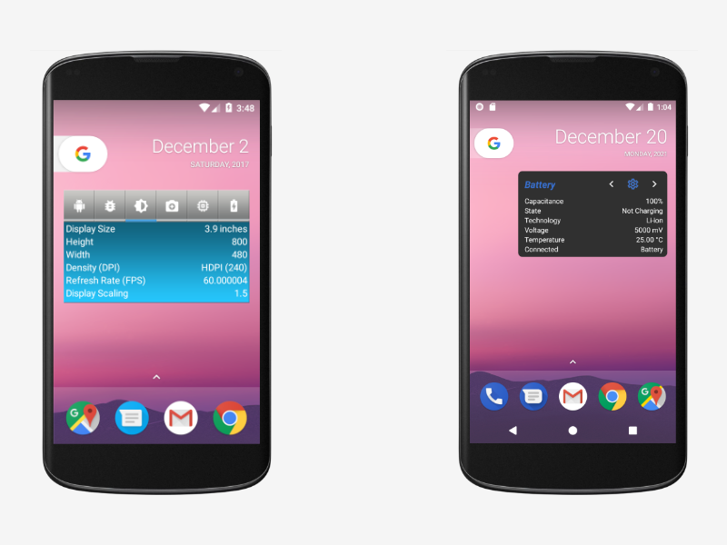

# SystemInfo-Widget - App Widget for Android

SystemInfo-Widget is a widget that shows you information about your smartphone/tablet. 
You can choose from six categories.

* Battery
* Camera
* Display
* General
* Advanced (More)
* Network

## Motivation

That was the first app I had ever written and published. Since then, a lot has happened, 
such as the arrival of Kotlin, a new programming language. 
I think you can write more transparent and expressive code with Kotlin. 
I took this as an opportunity to give my first app a complete makeover.

